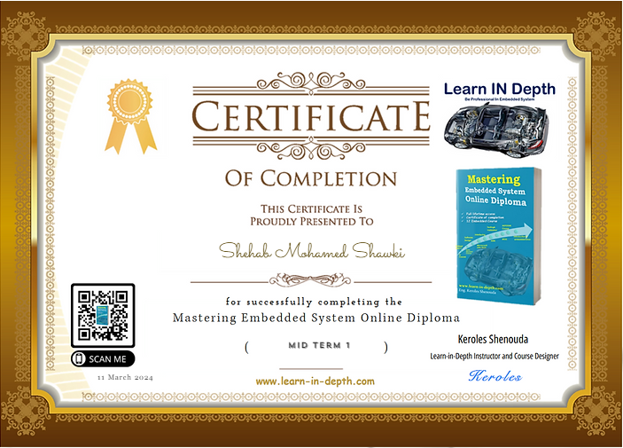

# UNIT 2 C PROGRAMMING
<h1 align = "centre" > Here we are include the all homeworks for 8 leassons.</h1>

   
  

## Lessons Learned

learn in depth of c programming. 

# Table Of Contents

- [LESSON1](https://github.com/shehabhassan/Mastering_Embedded_Systems/tree/master/Unit2_C_Programming/Lesson1_Installing_c_Tools)
- [LESSON2](https://github.com/shehabhassan/Mastering_Embedded_Systems/tree/master/Unit2_C_Programming/Lesson2_Git_Repository)
- [LESSON3](https://github.com/shehabhassan/Mastering_Embedded_Systems/tree/master/Unit2_C_Programming/Lesson3_Basic)
- [LESSON4](#features)
- [LESSON5](https://github.com/shehabhassan/Mastering_Embedded_Systems/tree/master/Unit2_C_Programming/Lesson5_Function)
- [LESSON6](#license)
- [LESSON7](https://github.com/shehabhassan/Mastering_Embedded_Systems/tree/master/Unit2_C_Programming/Lesson7_Preprocessor)
- [LESSON8](https://github.com/shehabhassan/Mastering_Embedded_Systems/tree/master/Unit2_C_Programming/Lesson8_pointer)
- [MID_TERM](https://github.com/shehabhassan/Mastering_Embedded_Systems/tree/master/Unit2_C_Programming/MidTerm_Answer)

## Authors
- [@SHEHABHASSAN](https://github.com/shehabhassan)

